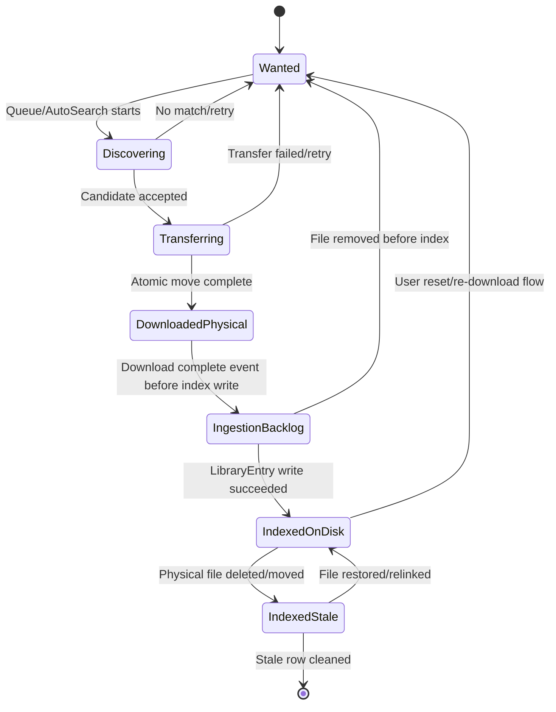
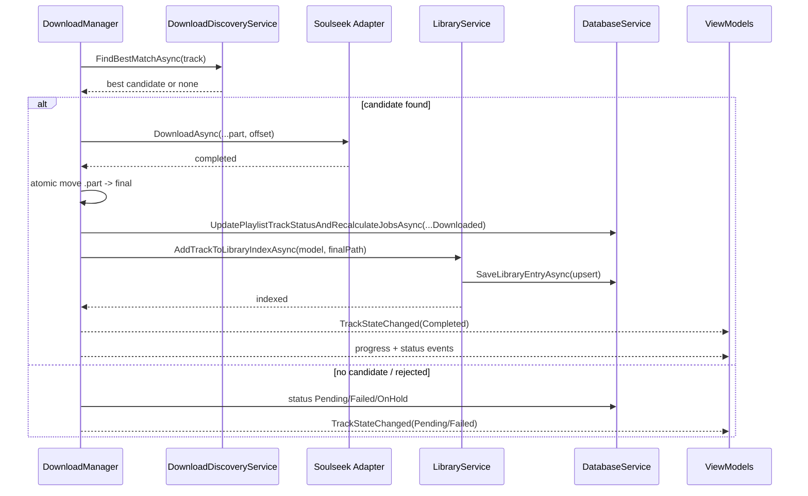

# Post-Metrics Lifecycle Audit Playbook

Date: 2026-05-21
Status: Ready for execution
Scope: Download -> Ingestion -> Indexing -> Projection consistency

## Canonical Metrics
These counters are the required truth model after the Analysis dashboard separation.

- DesiredDownloadCount: wanted targets still not successfully completed in pipeline terms (Missing, Pending, OnHold, Failed).
- IngestionBacklogCount: downloaded file exists physically, but hash not represented in on-disk indexed set yet.
- OnDiskIndexedTrackCount: index entries whose FilePath exists on disk.
- StaleIndexedCount: index entries whose FilePath no longer exists on disk.
- IndexedCatalogCount: all index entries, independent of physical existence.

Required invariant:

- IndexedCatalogCount = OnDiskIndexedTrackCount + StaleIndexedCount

## Artifact 1: File Lifecycle State Machine

State-to-metric mapping:

- Wanted contributes to DesiredDownloadCount.
- IngestionBacklog contributes to IngestionBacklogCount.
- IndexedOnDisk contributes to OnDiskIndexedTrackCount and IndexedCatalogCount.
- IndexedStale contributes to StaleIndexedCount and IndexedCatalogCount.

## Artifact 2: Download -> Ingestion -> Indexing Sequence

## Code Anchors (Investigation Targets)

Download pipeline:

- Services/DownloadManager.cs
  - ProcessTrackAsync
  - DownloadFileAsync
  - UpdateStateAsync
  - ResolveDiscoveryWithStrictGateAsync
- Services/DownloadDiscoveryService.cs
  - FindBestMatchAsync
  - PerformSearchTierAsync
- Services/AutoDownload/AutoSearchService.cs
  - FindBestMatchAsync
  - SearchExactFilenameAsync
  - SearchFilteredTemplateAsync

Ingestion/indexing:

- Services/LibraryService.cs
  - AddTrackToLibraryIndexAsync
  - SaveOrUpdateLibraryEntryAsync
  - SyncLibraryEntriesFromTracksAsync
- Services/DatabaseService.cs
  - SaveLibraryEntryAsync
  - UpdatePlaylistTrackStatusAndRecalculateJobsAsync

GUI projections:

- ViewModels/AnalysisPageViewModel.cs
  - LoadLibraryAsync
  - differentiation counters and summary
- Views/Avalonia/AnalysisPage.axaml
  - dashboard cards and count summary banner
- ViewModels/Downloads/DownloadCenterViewModel.cs
- ViewModels/Downloads/UnifiedTrackViewModel.cs

## Artifact 3: GUI Validation Script
Run this script manually while app is open to validate transitions and projection consistency.

1. Start app and open Analysis page.
2. Record baseline counters from dashboard:
   - Wanted
   - Ingestion backlog
   - On disk indexed
   - Stale indexed
   - Indexed catalog (if surfaced in summary)
3. Trigger one fresh download that is not currently indexed.
4. Expected transition:
   - Wanted decreases by 1 after successful completion.
   - Ingestion backlog may transiently increment by 1 during index handoff.
   - On disk indexed increments by 1 after indexing completes.
   - Stale unchanged.
5. Delete one physically indexed file from disk.
6. Expected transition after refresh/reload:
   - On disk indexed decrements by 1.
   - Stale increments by 1.
   - Indexed catalog unchanged.
7. Run backfill/reindex path.
8. Expected transition:
   - Ingestion backlog decrements as entries are indexed.
   - If stale cleanup is enabled, stale decrements accordingly.
9. Restart app.
10. Expected: all counters persist and rehydrate consistently.

Pass criteria:

- Invariant holds: IndexedCatalog = OnDiskIndexed + Stale.
- No UI surface shows "downloaded" while only stale entry exists.
- Download center does not imply ingestion completion before index write.

## Artifact 4: Test Plan (Unit + Integration)

### A. Unit tests

1. Analysis counter mapping
   - File: Tests/.../ViewModels/AnalysisPageViewModelTests.cs
   - Validate counter math and invariant under mixed existing/missing FilePath sets.

2. Strict mode stale behavior
   - File: Tests/.../Services/AutoDownload/...Tests.cs
   - Ensure stale indexed entry does not short-circuit discovery as "already downloaded".

3. Ingestion backlog detection
   - File: Tests/.../Services/LibraryServiceTests.cs
   - Downloaded PlaylistTrack with existing ResolvedFilePath and missing hash in index should count as backlog.

4. Discovery physical-first checks
   - File: Tests/.../Services/DownloadManagerTests.cs
   - Existing DB row without file should not be treated as complete.

### B. Integration tests

1. End-to-end lifecycle
   - Queue -> download -> indexed -> verify counters in VM snapshot.

2. File deletion lifecycle
   - Delete indexed file -> stale increments -> on-disk decrements.

3. Reindex convergence
   - Reindex operation recomputes all five counters deterministically.

### C. Diagnostics assertions

1. Activity logs include distinct events:
   - download complete
   - ingestion started
   - ingestion completed
   - stale detected
2. Evidence script includes ingestion and stale actions in output filtering.

## Execution Sequence (Revamped)

Phase A: Lifecycle correctness

1. Validate download completion vs ingestion completion boundaries in DownloadManager and LibraryService.
2. Validate stale handling when DB exists but file is missing.
3. Validate backlog transitions for downloaded-but-not-indexed.

Phase B: Data correctness

4. Audit DatabaseService queries for indexed vs on-disk semantics.
5. Validate stale and backlog persistence across restart.

Phase C: UI correctness

6. Validate Analysis dashboard counters and banner semantics.
7. Validate DownloadCenter and UnifiedTrack states do not conflate download complete with index complete.
8. Validate any library page counts label indexed vs physical correctly.

Phase D: Events + diagnostics

9. Verify event publication boundaries (download vs ingestion).
10. Add/verify dedicated lifecycle diagnostics in ActivityLogs and runtime logs.

Phase E: Tests

11. Add unit tests for counter math and strict-mode stale behavior.
12. Add integration tests for lifecycle transitions and restart persistence.

## Immediate Delta Tasks (next coding pass)

1. Introduce explicit ingestion lifecycle events in Events/LibraryDomainEvents.cs.
2. Emit those events in Services/DownloadManager.cs and Services/LibraryService.cs.
3. Surface ingestion-pending state in ViewModels/Downloads/DownloadCenterViewModel.cs.
4. Add first test file for Analysis counter invariants.
