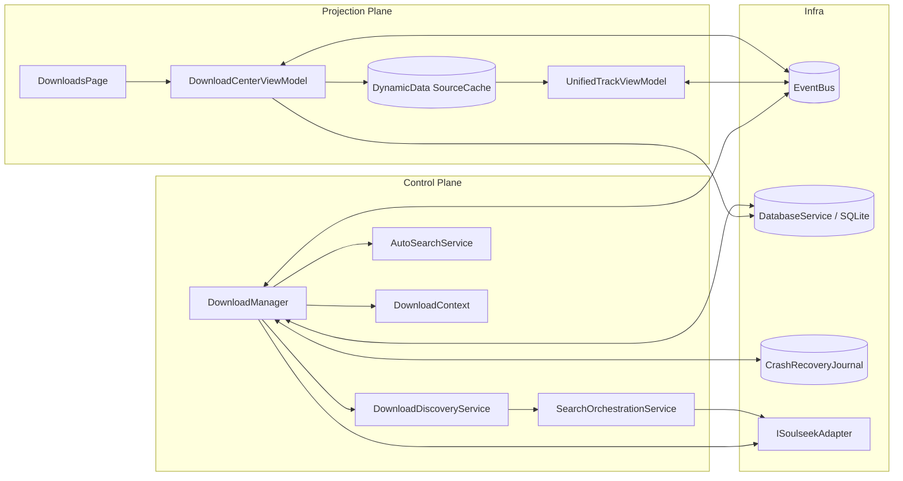
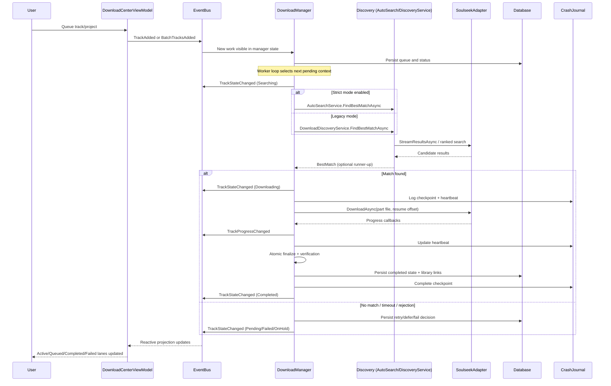

# Download Center Architecture v2

Status: Authoritative runtime architecture snapshot  
Date: 2026-05-21  
Scope: Download Center control plane, projection plane, event flow, recovery, and refactor seams

## Purpose

This document is the source of truth for how Download Center orchestration works today.

It describes:

1. Runtime ownership and object lifetime
2. Durable vs transient state model
3. End-to-end orchestration sequence
4. Projection-plane synchronization
5. Cross-cutting reliability behavior
6. Current architectural risks and bounded refactor direction

## Canonical Components

Core control-plane anchor:

1. [Services/DownloadManager.cs](Services/DownloadManager.cs)

Primary collaborators:

1. [Services/DownloadDiscoveryService.cs](Services/DownloadDiscoveryService.cs)
2. [Services/SearchOrchestrationService.cs](Services/SearchOrchestrationService.cs)
3. [Services/AutoDownload/AutoSearchService.cs](Services/AutoDownload/AutoSearchService.cs)
4. [Services/ISoulseekAdapter.cs](Services/ISoulseekAdapter.cs)
5. [Services/Models/DownloadContext.cs](Services/Models/DownloadContext.cs)

Projection plane:

1. [ViewModels/Downloads/DownloadCenterViewModel.cs](ViewModels/Downloads/DownloadCenterViewModel.cs)
2. [ViewModels/Downloads/UnifiedTrackViewModel.cs](ViewModels/Downloads/UnifiedTrackViewModel.cs)
3. [Views/Avalonia/DownloadsPage.axaml](Views/Avalonia/DownloadsPage.axaml)

Contracts:

1. [Models/Events.cs](Models/Events.cs)
2. [Models/PlaylistTrack.cs](Models/PlaylistTrack.cs)

DI and runtime boot:

1. [App.axaml.cs](App.axaml.cs)

## Runtime Ownership and Lifetime

Singleton control-plane services:

1. DownloadManager
2. DownloadDiscoveryService
3. SearchOrchestrationService
4. AutoSearchService
5. DownloadCenterViewModel

Transient/per-track runtime objects:

1. DownloadContext
2. UnifiedTrackViewModel

Implication:

1. Download Center behaves as a long-lived subsystem for the full app session.
2. Queueing, orchestration, recovery, transfer, and status publication all live in one active control plane.

## State Model

Durable state:

1. TrackStatus enum in PlaylistTrack model captures persistence-friendly coarse state.

Transient runtime state:

1. PlaylistTrackState enum captures execution state for queue/search/download lifecycle.

Design outcome:

1. DB keeps stable state for restart and history.
2. Runtime tracks high-resolution transition state for orchestration and UX.

## Component Diagram

## End-to-End Sequence

## Control-Plane Flow

1. Intake and dedupe: queue APIs merge incoming tracks, skip duplicates, and preserve project context.
2. Hydration and recovery: startup restores pending and recent history, then reconciles crash journal checkpoints.
3. Worker scheduling: a global semaphore enforces strict concurrency; selection is priority-first then added-time.
4. Discovery: strict-mode exact-first pipeline is attempted first; legacy tiered discovery is fallback.
5. Transfer: resumable part-file transfer with peer gating, heartbeat, stall detection, and optional hedge failover.
6. Finalization: atomic move, verification, persistent state sync, and event publication.

## Projection-Plane Flow

1. DownloadCenterViewModel subscribes to creation/removal/state/progress/status events.
2. SourceCache drives filtered collections for active, queued, completed, failed, and grouped projections.
3. UnifiedTrackViewModel owns per-row reactive behavior and track-level command surfaces.
4. Soft-clear behavior is projection-filter based and persists via model flag updates.

## Cross-Cutting Reliability

1. Crash safety: checkpoint journal plus periodic heartbeat supports safe resume and orphan cleanup.
2. Backpressure: semaphore slot governance, search lane tuning, and circuit-breaker disconnect handling.
3. Operator transparency: detailed status events and global status banners surface runtime behavior.
4. Integrity path: post-transfer verification and atomic finalize reduce corruption and torn-write outcomes.

## Known Risks

1. DownloadManager concentration: queueing, discovery, transfer, recovery, and publication are tightly centralized.
2. Event contract sprawl: broad shared event file increases cross-domain coupling risk.
3. Dual orchestration semantics: thin orchestration facade exists while real control remains in DownloadManager.
4. Drift pressure: architecture docs can lag rapidly evolving manager internals.

## Refactor Direction (Bounded, Low-Churn)

Keep UI projection stable; extract internal collaborators from DownloadManager:

1. QueueLifecycleCoordinator
2. DiscoveryCoordinator
3. TransferCoordinator
4. RecoveryAndResumeService

Contract partitioning target:

1. Download events
2. Search events
3. Health events
4. UI status events

Expected outcome:

1. Lower blast radius for changes
2. Clearer ownership seams for testing and maintenance
3. No functional regression in DownloadCenterViewModel/UnifiedTrackViewModel projection surfaces

## Validation Checklist

1. App startup hydrates active + recent + persisted queue without duplicate rows.
2. Queue to complete path publishes TrackStateChanged and TrackProgressChanged consistently.
3. Strict-mode and legacy discovery paths both resolve through the same transfer/finalization contract.
4. Soft-clear hides rows from ledger while preserving model and persistence semantics.
5. Crash resume preserves part-file safety and avoids zombie replay loops.
