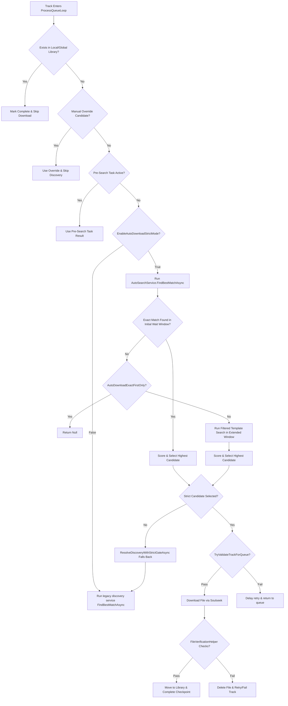

# Download Filtering & Strict Mode Hardening Plan

> Status: Historical rationale / superseded in part by implemented slices
>
> See also: [Download Filtering Phase 2 Completion Report](download_filtering_phase2_completion_report.md) for current operational state.
>
> Last reviewed: 2026-05-26

This document details the end-to-end investigation and design hardening plan for ORBIT-Pure's automatic download filtering and strict-mode orchestrator pipeline. 

---

## 1. End-to-End Orchestration Flow (The "Ifs and Thats")

When a playlist track is processed for automatic download via Soulseek, it traverses the following logic:



---

## 2. Active Configuration Properties & UI Wiring

The Settings page (`SettingsPage.axaml`) and its view model (`SettingsViewModel.cs`) expose and persist the following strict-mode settings directly to `AppConfig.cs`:

| UI Parameter Name | Configuration Property | Default Value | UI Constraint / Clamp |
| :--- | :--- | :--- | :--- |
| **Strict Mode Toggle** | `EnableAutoDownloadStrictMode` | `false` | Boolean switch |
| **Initial Wait** | `AutoDownloadInitialWaitMs` | `4000` | `1000` to `10000` ms (step: 500) |
| **Extended Wait** | `AutoDownloadExtendedWaitMs` | `20000` | `5000` to `60000` ms (step: 1000) |
| **Allowed Extensions** | `AutoDownloadAllowedExtensions` | `flac,wav,aiff,aif,ape,alac` | CSV string parsed to list |
| **Min File Size** | `AutoDownloadMinFileSizeBytes` | `512000` (500KB) | `262144` to `5242880` bytes (step: 256KB) |
| **Min Bitrate** | `AutoDownloadMinBitrateKbps` | `320` | `128` to `320` kbps (step: 32) |
| **Exact First Only** | `AutoDownloadExactFirstOnly` | `false` | Boolean switch |
| **Max Candidates** | `AutoDownloadMaxCandidatesToScore` | `50` | `10` to `200` candidates (step: 10) |
| **Excluded Phrases** | `AutoDownloadExcludedPhrases` | `remix,cover,live,acoustic` | CSV string parsed to list |
| **Diagnostics Logging** | `AutoDownloadDiagnosticsEnabled` | `false` | Boolean switch |
| **Min Search Duration** | `MinSearchDurationSeconds` | `5` | `1` to `60` seconds (step: 1) |

All configuration wiring in `SettingsViewModel.cs` correctly reads from and writes to `AppConfig`, immediately invoking `SaveSettings()` to persist values locally.

---

## 3. Detected Design Flaws & Loophole Analysis

Our end-to-end audit revealed several critical loopholes, logic bugs, and structural flaws in the current strict-mode implementation:

### Flaw A: The "Soft Fallback" Loophole in Strict Mode Routing
* **Code Location**: `DownloadManager.cs` -> [ResolveDiscoveryWithStrictGateAsync](file:///c:/Users/quint/OneDrive/Documenten/GitHub/ORBIT-Pure/Services/DownloadManager.cs#L2705)
* **Description**: If `strictModeEnabled` is true, the gate invokes `_autoSearchService.FindBestMatchAsync()`. If this strict search returns `null` (no results pass quality, format, or exact filters), the gate immediately falls back to:
  ```csharp
  return await legacyDiscovery();
  ```
* **Consequence**: The "Strict Mode" becomes soft. If strict mode returns nothing, the app silently falls back to legacy fuzzy search, which has relaxed constraints (e.g. automatically falling back to MP3 formats even if the user wanted strict FLAC/lossless).

### Flaw B: Multiple `ext:` Search Token ANDing Protocol Bug
* **Code Location**: `SoulseekSearchHelper.cs` -> [BuildFilterTokens](file:///c:/Users/quint/OneDrive/Documenten/GitHub/ORBIT-Pure/Services/AutoDownload/SoulseekSearchHelper.cs#L139)
* **Description**: When multiple formats are allowed, the helper appends all of them as `ext:FORMAT` tokens to the query text (e.g., query becomes `artist title minbitrate:320 mfs:512000 ext:flac ext:wav`).
* **Consequence**: Since the Soulseek network server treats all terms in the query text as `AND` operands, searching for `ext:flac ext:wav ext:aiff` requests a single file that has all three extensions. This query returns **zero** results from the server.
* **Correction**: Only append `ext:FORMAT` when exactly **one** extension is allowed. If multiple formats are allowed, do not append `ext:` to the query text; instead, rely on the client-side `fileFilter` in `StreamResultsAsync` which is already properly configured to match any of the allowed formats.

### Flaw C: Complete Ignorance of Track Duration / Length
* **Code Location**: `AutoSearchService.cs` and `MatchScorer.cs`
* **Description**: Unlike the legacy search matcher (`SearchResultMatcher`), the strict mode pipeline completely ignores track duration. Duration is not checked in `SoulseekSearchHelper.FilterCandidates`, nor is it checked or scored in `MatchScorer.ScoreCandidate`.
* **Consequence**: If a search matches a track by name, the system will gladly download a 2-hour long DJ mix, a 1-minute radio edit, or an entirely different track/version that happens to contain the title/artist in its name.
* **Correction**: Enforce a duration filter (e.g., candidate duration must be within ±3 seconds of `targetTrack.CanonicalDuration` if it is present) and include duration proximity scoring in `MatchScorer`.

### Flaw D: scoring Loophole for Invalid Formats
* **Code Location**: `MatchScorer.cs` -> [ScoreFormat](file:///c:/Users/quint/OneDrive/Documenten/GitHub/ORBIT-Pure/Services/AutoDownload/MatchScorer.cs#L105)
* **Description**: If a candidate format is not allowed (and is not MP3), it returns a score of `0.3` instead of `0.0`.
* **Consequence**: Files with unallowed formats (like `.wma`, `.m4a`, etc.) still get positive formatting points contributing to their final score.
* **Correction**: Return `0.0` for any unallowed formats.

### Flaw E: Fake FLAC (Transcode) is Not Rejected Hard
* **Code Location**: `MatchScorer.cs` -> [ScoreBitrate](file:///c:/Users/quint/OneDrive/Documenten/GitHub/ORBIT-Pure/Services/AutoDownload/MatchScorer.cs#L138)
* **Description**: If a FLAC file has a bitrate under 400kbps, it is identified as a fake FLAC and receives `0.0` for its bitrate score. However, this does not reject the candidate; it only reduces the total score.
* **Consequence**: A fake FLAC candidate can still score up to `85` points from exactness, format, reliability, and response time, easily passing the acceptance threshold and getting downloaded.
* **Correction**: Return a special low value (e.g. `0.0` for the entire match score) or trigger a hard rejection for fake FLACs.

### Flaw F: Missing Score Acceptance Threshold
* **Code Location**: `AutoSearchService.cs` -> [SelectBestCandidateAsync](file:///c:/Users/quint/OneDrive/Documenten/GitHub/ORBIT-Pure/Services/AutoDownload/AutoSearchService.cs#L334)
* **Description**: Unlike legacy search (which requires score >= 70/100), strict mode has no minimum score threshold. It orders candidates by score and picks the first one, meaning it will happily select and download a candidate even if its score is `10/100`.
* **Consequence**: Extremely poor matches will still get downloaded automatically.
* **Correction**: Enforce a minimum score threshold (e.g. 75/100) before selecting a candidate.

### Flaw G: Incomplete PrefetchVerifier Integration
* **Code Location**: `DownloadManager.cs`
* **Description**: `PrefetchVerifier` is registered in DI and contains advanced verification logic (such as checking file sizes against the strict mode configuration, enforcing whitelisted extensions, and stubbing Essentia audio fingerprint verification). However, it is never called inside `DownloadManager.cs`. The manager relies on basic hardcoded checks.
* **Correction**: Invoke `PrefetchVerifier.VerifyDownloadAsync(...)` in the post-download block of `DownloadManager.cs` when strict mode is active.

---

## 4. Hardening and Improvement Plan

To resolve these flaws without affecting the core non-invasive architecture, we will implement the following improvements:

### Phase 1: Harden Query Token Construction & Filtering
1. **Fix `BuildFilterTokens`**:
   - Check the length of `formats`.
   - IF `formats.Count == 1`: Append `ext:FORMAT` to the text query.
   - IF `formats.Count > 1`: Do NOT append any `ext:` tokens to the query text. (Let the client-side `fileFilter` handle it).
2. **Add Duration Gate**:
   - Introduce a duration check in `SoulseekSearchHelper.FilterCandidates`.
   - If `targetTrack.CanonicalDuration` is present (and > 0), reject any candidate whose duration deviates from it by more than `_config.SearchLengthToleranceSeconds` (default 3s).

### Phase 2: Refactor MatchScorer Logic
1. **Harden `ScoreFormat`**:
   - Return `0.0` if `!isAllowedFormat` (regardless of whether it is MP3 or not).
2. **Harden Fake FLAC Detection**:
   - If `format == "flac"` and `candidateBitrate > 0 && candidateBitrate < 400`, immediately return `0.0` for the *entire* candidate score (hard-fail).
3. **Add Duration Component to Scoring**:
   - Integrate duration score (e.g. weight: 20%) into `MatchScorer.ScoreCandidate`, reducing the weight of exactness slightly (e.g. from 50% to 40%) or adjusting component weights to include duration proximity.

### Phase 3: Update AutoSearchService Logic
1. **Enforce Match Acceptance Threshold**:
   - In `SelectBestCandidateAsync`, reject the candidate if its score is less than `75` (or a configurable strict threshold, e.g., 75/100).
2. **Handle Incomplete Peer Metadata Safely**:
   - Ensure candidates with zero bitrate/size are penalized appropriately in scoring or filtered out if strict criteria demand it.

### Phase 4: Hardening Strict Mode Fallback in DownloadManager
1. **Resolve Soft Fallback**:
   - In `ResolveDiscoveryWithStrictGateAsync`, if strict mode is enabled, do NOT automatically fallback to `legacyDiscovery()`.
   - Instead, check if `strictResult.BestMatch` is null. If it is null:
     - IF `AllowMp3Fallback` is allowed (or track is `OnHold`), we can allow a strict fallback or just return `null`.
     - Otherwise, return a result with `BestMatch = null`, preventing any fuzzy legacy discovery bypass.

### Phase 5: Wire PrefetchVerifier into Download Pipeline
1. **Integrate Prefetch Verification**:
   - Inject `PrefetchVerifier` into `DownloadManager`'s constructor.
   - In `DownloadFileAsync`, right after atomic rename succeeds:
     - Check if strict mode is enabled.
     - IF enabled, call `await _prefetchVerifier.VerifyDownloadAsync(ctx.Model, bestMatch, finalPath, ct)`.
     - IF verification fails (returns any result other than `Success` or `Disabled`), delete the file and mark the track state as `Failed` with `DownloadFailureReason.FileVerificationFailed`.

---

## 5. Verification & Test Strategy

### Automated Tests
We will implement/un-stub the tests under `Tests/SLSKDONET.Tests/Services/AutoDownload/` to cover:
1. **Query Token Generation**:
   - Single extension -> `ext:` token appended.
   - Multiple extensions -> no `ext:` token appended.
2. **Duration Filter**:
   - Candidate with duration delta <= 3s passes.
   - Candidate with duration delta > 3s is rejected.
3. **MatchScorer Integrity**:
   - Invalid formats receive 0.0 score.
   - Fake FLAC (< 400kbps) returns 0.0 overall score.
   - Deterministic scoring remains consistent.
4. **Acceptance Threshold**:
   - Candidate scoring 74/100 is rejected when threshold is 75.
   - Candidate scoring 76/100 is accepted.
5. **No Soft Fallback**:
   - Verifying that when strict mode is active and search returns null, `legacyDiscovery` is not run.

### Manual Verification
1. Enable strict mode in Settings page.
2. Queue tracks for auto-download.
3. Verify via diagnostic logging that searches are executed strictly and fail rather than falling back to loose fuzzy matching.
