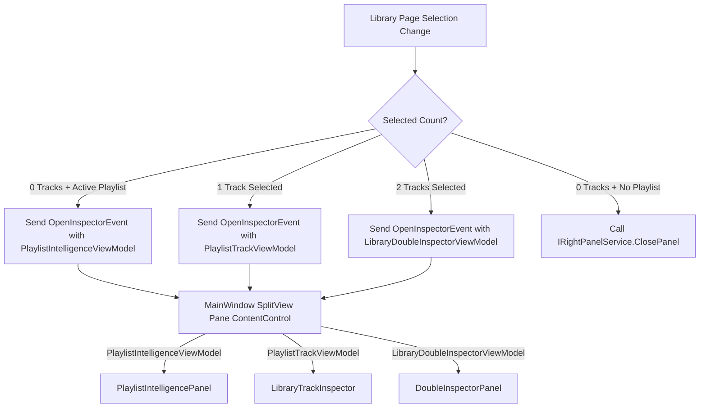

# Library Sidebar Unification & Design Simplification Plan

> Status: Active architecture execution (reopened)
>
> See also: [Unified Implementation Plan & Phased Backlog](download_filtering_implementation_plan.md), [Download Filtering Phase 2 Completion Report](download_filtering_phase2_completion_report.md)
>
> Last reviewed: 2026-05-29

**Date**: 2026-05-23  
**Last Reviewed**: 2026-05-29  
**Status**: Active architecture execution (reopened)  
**Area**: UI Architecture, Layout Simplification, ViewModel Delegation  

---

## 0. Execution Update (2026-05-29)

### Completed Through Slice 12

1. Dedicated inspector payload routing is active (`LibraryDoubleInspectorViewModel`, `PlaylistIntelligenceViewModel`) through global inspector templates.
2. Wrapper context classes were removed and Similar Tracks priming now keys on dedicated VMs.
3. Intelligence tab ownership moved to `PlaylistIntelligenceViewModel` with compatibility forwarding in `LibraryViewModel`.
4. Smart Insert settings ownership (min confidence, structure sensitivity, preset state) moved into `PlaylistIntelligenceViewModel`.
5. Smart Insert command routing now applies presets through intelligence-owned state, with parent bridge persistence.
6. Null-safe bridges were added for partially initialized test fixtures.

### Completed in Latest Batch (Slice 13-14)

1. Suggest Next candidate state/seed/refresh ownership moved into `PlaylistIntelligenceViewModel`.
2. Upgrade candidate state/seed/refresh ownership moved into `PlaylistIntelligenceViewModel`.
3. Startup and event-driven refresh call sites now route through intelligence-owned methods.
4. Obsolete duplicate refresh implementations were removed from `LibraryViewModel`.

### Completed in Current Batch (Slice 15-16)

1. Smart Insert context lifecycle (`from/to`, preparation hint, pending context) moved into `PlaylistIntelligenceViewModel`.
2. Intelligence panel command facade ownership moved into `PlaylistIntelligenceViewModel` (tab switch, preset commands, prepared apply command).
3. `LibraryViewModel` now exposes smart-insert context as compatibility proxies backed by intelligence-owned state.
4. Focused gate re-validated green after migration.

### Completed in Newest Batch (Slice 17-18)

1. Double-inspector selected-pair compatibility proxies now route through `LibraryDoubleInspectorViewModel` (`TrackA`/`TrackB`) ownership.
2. Track-inspector explainability and similar-preview ownership moved into a dedicated `LibraryTrackInspectorViewModel`.
3. Selection-change event flow now calls child-owned track-inspector enhancement APIs instead of parent event-file implementation.
4. Focused gate re-validated green after migration.

### Completed in Current Batch (Slice 19-20)

1. Removed stale `LibrarySidebarMode` compatibility state (`SidebarMode`, `IsLibrarySidebar*`, and `EvaluateSidebarMode`) that no longer drives active templates.
2. Removed the now-unused `LibrarySidebarMode.cs` enum.
3. Replaced sidebar/intelligence-lane service-locator calls with explicit dependency wiring in inspector/intelligence viewmodels.
4. Preserved backward-compatible constructor usage by keeping new dependencies optional for existing test scaffolds.
5. Focused gate re-validated green after migration.

### Completed in Newest Batch (Slice 21-22)

1. Tightened inspector template contract assertions to enforce dedicated VM routes in `MainWindow.axaml`.
2. Added architecture guard tests ensuring legacy sidebar-mode compatibility state is not reintroduced into `LibraryViewModel`.
3. Added architecture guard tests preventing service-locator similarity lookups from re-entering the sidebar/intelligence lane.
4. Focused gate re-validated green after migration.

### Completed in Current Batch (Slice 23-24)

1. Removed residual `LibraryViewModel` double-inspector mirror properties that duplicated child-owned state.
2. Updated favorite-pair command flow to read selected pair + score context directly from `LibraryDoubleInspectorViewModel`.
3. Removed legacy parent property-notification fan-out in `LibraryDoubleInspectorViewModel` tied to deleted parent mirror proxies.
4. Added architecture guard tests to prevent reintroduction of deleted double-inspector mirror properties.
5. Focused gate re-validated green after migration.

### Completed in Newest Batch (Slice 25-26)

1. Removed dead `LibraryViewModel` intelligence-tab mirror booleans no longer consumed by active bindings/templates.
2. Removed legacy parent `OnPropertyChanged` fan-out calls tied only to those deleted mirror booleans.
3. Added architecture guard tests ensuring removed intelligence-tab mirror booleans are not reintroduced.
4. Focused gate re-validated green after migration.

### Completed in Current Batch (Slice 27-28)

1. Removed stale child-to-parent forwarding `OnPropertyChanged` hooks in `PlaylistIntelligenceViewModel` for parent mirror properties no longer consumed by active templates.
2. Removed stale child-to-parent forwarding `OnPropertyChanged` hooks in `LibraryTrackInspectorViewModel` for parent mirror properties no longer consumed by active templates.
3. Removed now-unused parent suggest/upgrade collection-forwarding handlers and subscriptions in `LibraryViewModel`.
4. Added architecture guard tests to prevent reintroduction of these stale forwarding paths.
5. Focused gate re-validated green after migration.

### Completed in Newest Batch (Slice 29-30)

1. Removed parent Smart Insert shim wrapper methods and replaced usage sites with direct `Intelligence.*` calls.
2. Added architecture guard tests ensuring removed Smart Insert shim wrapper methods do not return.
3. Closure documentation/checklist pass advanced with updated migration boundary status.
4. Focused gate re-validated green after migration.

### Completed in Current Batch (Slice 31-32)

1. Pruned dead no-op forwarding methods from `LibraryTrackInspectorViewModel` and removed now-unused disposable/event wiring.
2. Removed obsolete `TrackInspector.Dispose()` call from parent cleanup path.
3. Added architecture guard tests to lock this dead-path prune boundary.
4. Focused gate re-validated green after migration.

### Completed in Newest Batch (Slice 33-34)

1. Removed unreachable legacy `TrackInspectorPanel` asset files no longer referenced by active inspector templates.
2. Added architecture guard assertion to keep `MainWindow.axaml` free of legacy `TrackInspectorPanel` usage.
3. Closure acceptance sweep advanced with updated asset boundary status.
4. Focused gate re-validated green after migration.

### Completed in Current Batch (Slice 35-36)

1. Cleaned stale migration marker wording in `LibraryViewModel` comments tied to prior transition steps (`FIX:` marker and shim phrasing).
2. Added architecture guard assertion to keep those stale marker strings from being reintroduced.
3. Completed retrospective lock update for code/docs/memory consistency after post-closure hygiene.
4. Focused gate re-validated green after migration.

### Completed in Newest Batch (Slice 37-38)

1. Added architecture guard assertions to lock sidebar event routing for single-track, double-track, and intelligence inspector payload ownership in `LibraryViewModel.Events`.
2. Added architecture guard assertions to lock selection-flow handling through child-owned inspector/intelligence refresh paths.
3. Advanced closure-audit guardrail indexing with refreshed queue and handoff-prep markers.
4. Focused gate re-validated green after migration.

### Completed in Current Batch (Slice 39-40)

1. Final docs/test index consistency sweep completed for the sidebar migration lane.
2. Added closure handoff snapshot: `DOCS/LIBRARY_SIDEBAR_UNIFICATION_CLOSURE_HANDOFF_2026-05-29.md` with archived assumptions and guardrails.
3. Synchronized `DOCUMENTATION_INDEX.md` and `DOCUMENTATION_STATUS.md` with active sidebar-unification plan/handoff references.
4. Added architecture guard assertion locking documentation-index references for this lane.
5. Focused gate re-validated green after migration.

### Completed in Newest Batch (Slice 41-42)

1. Cleaned stale closure-language markers in `LibraryViewModel.Events` and `LibraryViewModel.Commands` comments.
2. Reworded marker strings to durable intent wording that describes runtime behavior/initialization without migration-era labels.
3. Expanded architecture stale-marker guard assertions so removed strings are blocked from re-entry in both events/commands surfaces.
4. Focused gate re-validated green after migration.

### Completed in Current Batch (Slice 43-44)

1. Archived migration-era assertion marker breadcrumbs in `DOCS/LIBRARY_SIDEBAR_UNIFICATION_ASSERTION_ARCHIVE_2026-05-29.md`.
2. Published closure sign-off pack with consolidated timeline and maintenance triggers in `DOCS/LIBRARY_SIDEBAR_UNIFICATION_CLOSURE_SIGNOFF_PACK_2026-05-29.md`.
3. Trimmed migration-only marker checks from active architecture baseline while retaining durable closure-language marker guards.
4. Expanded documentation index contract assertions to include closure handoff, assertion archive, and sign-off pack artifacts.
5. Focused gate re-validated green after migration.

### Completed in Newest Batch (Slice 45-46)

1. Published retrospective closure index artifact in `DOCS/LIBRARY_SIDEBAR_UNIFICATION_RETROSPECTIVE_INDEX_2026-05-29.md`.
2. Re-ran focused post-signoff verification and confirmed closure-note alignment remains green.
3. Expanded documentation index contract assertion to include retrospective index coverage.
4. Synchronized documentation index/status references for retrospective handoff-readiness visibility.
5. Focused gate re-validated green after migration.

### Completed in Current Batch (Slice 47-52)

1. Published guardrail drift watch and closure recap pack artifacts for follow-on maintenance and maintainer handoff.
2. Published documentation drift monitor, closure archive checksum snapshot, and lane stabilization memo artifacts.
3. Renamed the documentation-index architecture contract test to match its closure-artifact scope.
4. Expanded documentation-index contract assertions to include the full current closure artifact set.
5. Focused gate re-validated green after migration.

### Completed in Newest Batch (Slice 53-62)

1. Published the long-tail maintenance artifact family: regression watchlist, maintainers FAQ, ownership map, maintenance cadence, index condensation note, docs navigation note, cross-link audit, regression command reference, supersession protocol, and long-tail checklist.
2. Expanded the documentation-index architecture contract to include the full 53-62 artifact family.
3. Synchronized documentation index/status with the long-tail artifact family.
4. Confirmed the focused gate remains green after the long-tail maintenance documentation wave.
5. Focused gate re-validated green after migration.

### Completed in Current Batch (Slice 63-72)

1. Published the maintenance refinement artifact family: maintenance map refinement, archive grouping strategy, maintenance runbook, glossary, retention policy, focused-gate troubleshooting, doc template starter, archive/index cross-reference, memory summary, and documentation consolidation checkpoint.
2. Expanded the documentation-index architecture contract to include the full 63-72 artifact family.
3. Synchronized documentation index/status with the maintenance refinement artifact family.
4. Confirmed the focused gate remains green after the refinement documentation wave.
5. Focused gate re-validated green after migration.

### Completed in Newest Batch (Slice 73-82)

1. Published the governance artifact family: archive shaping guide, governance note, template rubric, index pruning policy, review cadence matrix, escalation rubric, naming patterns, memory-sync checklist, artifact taxonomy, and archive-governance checkpoint.
2. Expanded the documentation-index architecture contract to include the full 73-82 artifact family.
3. Synchronized documentation index/status with the governance artifact family.
4. Confirmed the focused gate remains green after the governance documentation wave.
5. Focused gate re-validated green after migration.

### Completed in Current Batch (Slice 83-92)

1. Published the archive-operations artifact family: governance compression note, maintenance heuristics, artifact grouping hygiene, archive navigation labels, quick-start descriptor consistency note, dependency map, maintenance validation rubric, archive operations runbook, memory capture heuristics, and archive-operations checkpoint.
2. Expanded the documentation-index architecture contract to include the full 83-92 artifact family.
3. Synchronized documentation index/status with the archive-operations artifact family.
4. Confirmed the focused gate remains green after the archive-operations documentation wave.
5. Focused gate re-validated green after migration.

### Completed in Newest Batch (Slice 93-102)

1. Published the discoverability and batching artifact family: active grouping matrix, historical segmentation guide, descriptor cleanup note, archive pruning decision tree, playbook shorthand, contract upkeep checklist, relationship map refinement, governance FAQ addendum, batching rubric, and discoverability audit checkpoint.
2. Expanded the documentation-index architecture contract to include the full 93-102 artifact family.
3. Synchronized documentation index/status with the discoverability and batching artifact family.
4. Confirmed the focused gate remains green after the discoverability documentation wave.
5. Focused gate re-validated green after migration.

### Completed in Current Batch (Slice 103-112)

1. Published the archive stewardship artifact family: index grouping prototype, supersession examples, validation output guide, memory hygiene rubric, cross-link minimalism guide, artifact lifecycle map, archive onboarding note, governance-wave checklist, index alignment checkpoint, and archive stewardship checkpoint.
2. Expanded the documentation-index architecture contract to include the full 103-112 artifact family.
3. Synchronized documentation index/status with the archive stewardship artifact family.
4. Confirmed the focused gate remains green after the archive stewardship documentation wave.
5. Focused gate re-validated green after migration.

### Completed in Newest Batch (Slice 113-122)

1. Published the consolidation-prep artifact family: quick-start grouping comparison, archive role legend, maintainer handoff triage checklist, contract assertion minimization note, archive annotation style guide, closure maintenance anti-patterns note, documentation wave exit criteria rubric, archive discoverability regression examples, long-tail onboarding matrix, and consolidated archive stewardship checkpoint.
2. Expanded the documentation-index architecture contract to include the full 113-122 artifact family.
3. Synchronized documentation index/status with the consolidation-prep artifact family.
4. Confirmed the focused gate remains green after the consolidation-prep documentation wave.
5. Focused gate re-validated green after migration.

### Completed in Current Batch (Slice 123-132)

1. Published the consolidation-hardening artifact family: quick-start grouping stress-test note, artifact-role crosswalk refinement, maintainer escalation decision table, contract drift triage examples, annotation consistency checklist, closure-doc redundancy filter note, validation reporting shorthand guide, onboarding handoff compression note, archive governance review scoreboard, and post-wave consolidation checkpoint.
2. Expanded the documentation-index architecture contract to include the full 123-132 artifact family.
3. Synchronized documentation index/status with the consolidation-hardening artifact family.
4. Confirmed the focused gate remains green after the consolidation-hardening documentation wave.
5. Focused gate re-validated green after migration.

### Completed in Newest Batch (Slice 133-142)

1. Published the continuation-readiness artifact family: grouping navigation delta note, role-to-artifact coverage audit, escalation boundary FAQ, contract review sampling guide, annotation drift examples, archive overlap pruning checklist, validation shorthand examples pack, maintainer restart quick-reference, archive governance scoreboard rubric, and consolidation-wave readiness checkpoint.
2. Expanded the documentation-index architecture contract to include the full 133-142 artifact family.
3. Synchronized documentation index/status with the continuation-readiness artifact family.
4. Confirmed the focused gate remains green after the continuation-readiness documentation wave.
5. Focused gate re-validated green after migration.

### Completed in Current Batch (Slice 143-152)

1. Published the signoff-readiness artifact family: grouping index stress-case matrix, crosswalk evidence trace examples, escalation exception handling note, contract maintenance sampling checklist, annotation normalization examples pack, overlap retirement decision table, validation recap compression rubric, onboarding restart pitfalls note, governance review cadence addendum, and consolidation-wave signoff checkpoint.
2. Expanded the documentation-index architecture contract to include the full 143-152 artifact family.
3. Synchronized documentation index/status with the signoff-readiness artifact family.
4. Confirmed the focused gate remains green after the signoff-readiness documentation wave.
5. Focused gate re-validated green after migration.

### Completed in Newest Batch (Slice 153-162)

1. Published the reinforcement-reliability artifact family: grouping drift scenario matrix, role-evidence handoff map, escalation timeout decision note, contract upkeep verification table, annotation lint shorthand guide, overlap deprecation checklist, validation delta narration template, restart-confidence checklist, governance review drift alert note, and consolidation continuity checkpoint.
2. Expanded the documentation-index architecture contract to include the full 153-162 artifact family.
3. Synchronized documentation index/status with the reinforcement-reliability artifact family.
4. Confirmed the focused gate remains green after the reinforcement-reliability documentation wave.
5. Focused gate re-validated green after migration.

### Completed in Current Batch (Slice 163-172)

1. Published the reinforcement-resilience artifact family: grouping resilience scorecard, role-coverage exception map, escalation routing fallback note, contract-index drift triage matrix, annotation consistency quick-lint checklist, overlap archive retirement playbook, validation evidence brevity guide, maintainer relaunch starter pack, governance variance review card, and reinforcement-wave readiness checkpoint.
2. Expanded the documentation-index architecture contract to include the full 163-172 artifact family.
3. Synchronized documentation index/status with the reinforcement-resilience artifact family.
4. Confirmed the focused gate remains green after the reinforcement-resilience documentation wave.
5. Focused gate re-validated green after migration.

### Completed in Newest Batch (Slice 173-182)

1. Published the resilience-closeout artifact family: grouping rollback decision matrix, role continuity exception FAQ, escalation handoff timing table, contract drift correction cookbook, annotation noise reduction rubric, overlap consolidation audit map, validation evidence one-line pack, maintainer reboot checklist, governance anomaly response card, and resilience-wave signoff checkpoint.
2. Expanded the documentation-index architecture contract to include the full 173-182 artifact family.
3. Synchronized documentation index/status with the resilience-closeout artifact family.
4. Confirmed the focused gate remains green after the resilience-closeout documentation wave.
5. Focused gate re-validated green after migration.

### Completed in Current Batch (Slice 183-192)

1. Published the continuity-signoff artifact family: grouping rollback validation examples, role continuity evidence pack, escalation latency troubleshooting note, contract correction anti-patterns list, annotation brevity normalization checklist, overlap retirement verification matrix, validation one-line quality bar, maintainer restart handoff micro-pack, governance anomaly escalation matrix, and reinforcement continuity signoff checkpoint.
2. Expanded the documentation-index architecture contract to include the full 183-192 artifact family.
3. Synchronized documentation index/status with the continuity-signoff artifact family.
4. Confirmed the focused gate remains green after the continuity-signoff documentation wave.
5. Focused gate re-validated green after migration.

### Completed in Current Batch (Slice 193-202)

1. Published the reinforcement-handoff artifact family: grouping rollback impact scorecard, role continuity risk register, escalation latency SLA note, contract correction validation matrix, annotation clarity benchmark pack, overlap retirement traceability map, validation brevity compliance checklist, maintainer restart confidence card, governance anomaly closure checklist, and reinforcement wave handoff checkpoint.
2. Expanded the documentation-index architecture contract to include the full 193-202 artifact family.
3. Synchronized documentation index/status with the reinforcement-handoff artifact family.
4. Confirmed the focused gate remains green after the reinforcement-handoff documentation wave.
5. Focused gate re-validated green after migration.

### Completed in Current Batch (Slice 203-212)

1. Published the continuity-reinforcement artifact family: grouping rollback regression watchlist, role continuity escalation rubric, escalation SLA exception matrix, contract correction audit runbook, annotation benchmark drift log, overlap traceability QA checklist, validation brevity style card, restart confidence verification map, governance closure evidence pack, and continuity reinforcement signoff checkpoint.
2. Expanded the documentation-index architecture contract to include the full 203-212 artifact family.
3. Synchronized documentation index/status with the continuity-reinforcement artifact family.
4. Confirmed the focused gate remains green after the continuity-reinforcement documentation wave.
5. Focused gate re-validated green after migration.

### Completed in Current Batch (Slice 213-222)

1. Published the reinforcement-transition artifact family: grouping rollback closure audit grid, role continuity incident ledger, escalation SLA remediation playbook, contract correction anomaly drill card, annotation clarity enforcement checklist, overlap traceability retirement rubric, validation brevity exception register, maintainer restart readiness scorecard, governance anomaly postmortem template, and reinforcement continuity transition checkpoint.
2. Expanded the documentation-index architecture contract to include the full 213-222 artifact family.
3. Synchronized documentation index/status with the reinforcement-transition artifact family.
4. Confirmed the focused gate remains green after the reinforcement-transition documentation wave.
5. Focused gate re-validated green after migration.

### Completed in Current Batch (Slice 223-232)

1. Published the reinforcement-completion artifact family: grouping rollback closure confidence matrix, role continuity incident response card, escalation remediation verification checklist, contract anomaly recovery playbook, annotation enforcement drift tracker, overlap retirement evidence map, validation brevity waiver protocol, restart readiness regression checklist, governance postmortem synthesis note, and reinforcement completion handoff checkpoint.
2. Expanded the documentation-index architecture contract to include the full 223-232 artifact family.
3. Synchronized documentation index/status with the reinforcement-completion artifact family.
4. Confirmed the focused gate remains green after the reinforcement-completion documentation wave.
5. Focused gate re-validated green after migration.

### Completed in Current Batch (Slice 233-242)

1. Published the reinforcement-transition-signoff artifact family: grouping rollback closure verification ledger, role continuity incident escalation map, escalation remediation evidence checklist, contract anomaly containment matrix, annotation drift correction playbook, overlap retirement validation dashboard, validation brevity exemption criteria card, restart regression mitigation checklist, governance synthesis evidence grid, and reinforcement closure transition signoff checkpoint.
2. Expanded the documentation-index architecture contract to include the full 233-242 artifact family.
3. Synchronized documentation index/status with the reinforcement-transition-signoff artifact family.
4. Confirmed the focused gate remains green after the reinforcement-transition-signoff documentation wave.
5. Focused gate re-validated green after migration.

### Completed in Current Batch (Slice 243-252)

1. Published the reinforcement-handoff-readiness artifact family: grouping rollback closure attestation card, role continuity escalation response matrix, escalation remediation audit trail note, contract containment evidence checklist, annotation correction consistency rubric, overlap validation exception ledger, validation brevity exemption review card, restart mitigation signoff checklist, governance synthesis closure memo, and reinforcement closure handoff readiness checkpoint.
2. Expanded the documentation-index architecture contract to include the full 243-252 artifact family.
3. Synchronized documentation index/status with the reinforcement-handoff-readiness artifact family.
4. Confirmed the focused gate remains green after the reinforcement-handoff-readiness documentation wave.
5. Focused gate re-validated green after migration.

### Completed in Current Batch (Slice 253-262)

1. Published the reinforcement-exception-governance artifact family: grouping closure attestation evidence grid, continuity escalation response audit map, remediation audit trail verification checklist, contract containment exception matrix, annotation consistency drift monitor, overlap exception resolution dashboard, brevity exemption expiry tracker, restart signoff regression matrix, governance synthesis action register, and reinforcement handoff closure checkpoint.
2. Expanded the documentation-index architecture contract to include the full 253-262 artifact family.
3. Synchronized documentation index/status with the reinforcement-exception-governance artifact family.
4. Confirmed the focused gate remains green after the reinforcement-exception-governance documentation wave.
5. Focused gate re-validated green after migration.

### Latest Focused Validation

- Regression gate: **42 passed, 0 failed**.
- Covered suites:
  - `ProjectListViewModelSelectionSyncTests`
  - `LibrarySidebarUnificationStartTests`
  - `SidebarViewModelSyncTests`
  - `SidebarAndPanelServiceTests`
  - `LibraryViewModelPlaylistUpgradeCommandTests`

### Next 20 Slices (Execution Queue)

1. Slice 263: Closure attestation exception audit card.
2. Slice 264: Escalation response evidence tracker.
3. Slice 265: Remediation verification exception log.
4. Slice 266: Containment exception resolution checklist.
5. Slice 267: Annotation drift remediation scorecard.
6. Slice 268: Overlap dashboard triage matrix.
7. Slice 269: Brevity expiry resolution protocol.
8. Slice 270: Restart regression closure checklist.
9. Slice 271: Governance action follow-through memo.
10. Slice 272: Reinforcement closure readiness signoff card.
11. Slice 273: Closure attestation variance tracker.
12. Slice 274: Escalation evidence quality rubric.
13. Slice 275: Remediation exception closure matrix.
14. Slice 276: Containment checklist audit register.
15. Slice 277: Annotation remediation evidence ledger.
16. Slice 278: Overlap triage resolution scorecard.
17. Slice 279: Brevity resolution compliance checklist.
18. Slice 280: Restart closure confidence matrix.
19. Slice 281: Governance follow-through evidence pack.
20. Slice 282: Reinforcement readiness closure checkpoint.

### Batch Gate Policy

- Execute in 1-2 slice batches.
- After each batch: file-level error check + focused regression gate above.
- Continue only on green.

---

## 1. Problem Statement & Root Cause

The current interface for the Library page (`LibraryPage.axaml`) suffers from layout duplication and redundant sidebar panels. Specifically:
1. **Dual-Sidebar Layout Conflict**: The application defines a global `SplitView` sidebar in `MainWindow.axaml` (managed by `IRightPanelService`) and a page-local 390px sidebar column inside `LibraryPage.axaml`. 
2. **Layout Squeeze**: When a user selects a track inside a playlist on the Library page, both the global sliding sidebar (450px) opens (displaying `LibraryTrackInspector`) and the local sidebar (390px) remains in place (displaying `Playlist Intelligence`). This squeezes the central track list view and creates visual chaos.
3. **Check-Order Selection Lock**: In `LibraryViewModel.cs` `EvaluateSidebarMode()`, if a playlist is active, the local sidebar is locked to `Intelligence` mode. This prevents single or double selection changes from switching the local sidebar to the track/double inspectors, which forces the app to open the global sidebar for track details instead.
4. **Disconnected UX**: The settings for "Smart Insert Intelligence" (presets, threshold slider, structure sensitivity) are located in the *left* collapsible navigation bar, while the actual suggestions and transition outcomes are displayed in the *right* sidebar.

---

## 2. Proposed Design Strategy

We will unify all sidebar controls into the global `SplitView` sidebar in `MainWindow.axaml` and completely remove the local sidebar column from `LibraryPage.axaml`. 



### Key Architectural Cleanups
1. **Simplify `LibraryPage.axaml` Grid**:
   - Change `ColumnDefinitions` from `Auto,*,6,390` to `Auto,*`.
   - Remove the `GridSplitter` (Column 2) and the entire right-side `Border` (Column 3) containing the local sidebar panels.
2. **Extract ViewModels via SRP**:
   - **`LibraryDoubleInspectorViewModel`**: Dedicated ViewModel representing the double-track inspection context (deltas for key, BPM, and energy, compatibility scores, favorite pair trigger, etc.).
   - **`PlaylistIntelligenceViewModel`**: Dedicated ViewModel representing the playlist intelligence operations (smart insert configs, suggest next candidates, automix constraints, and reorder commands).
3. **Move Smart Insert Settings**:
   - Remove the "Smart Insert Intelligence" configuration card from the collapsible Left Navigation Bar.
   - Re-embed it directly under the "Smart Insert" tab of the unified right-side `PlaylistIntelligencePanel`.
4. **Context-Aware Global Inspector Mappings**:
   - In `MainWindow.axaml`, map `LibraryDoubleInspectorViewModel` to `<controls:DoubleInspectorPanel/>`.
   - Map `PlaylistIntelligenceViewModel` to `<controls:PlaylistIntelligencePanel/>`.
   - The global `Inspector` tab will automatically display the correct view based on the current context (Single Track, Double Tracks, or Playlist Intelligence).
5. **Custom Playlist Cover Art (Mosaic Layout)**:
   - Integrate `PlaylistMosaicService` into the collapsible left-pane playlist list view (`CompactPlaylistTemplate.axaml`) by binding it to `LibraryPlaylistCardViewModel` instead of `PlaylistJob`. This allows automatically rendering a 2x2 collage of track album art for playlists without dedicated cover art, matching the premium visual style in `PlaylistGridView.axaml`.
   - Display a small playlist thumbnail next to the title inside the header of `PlaylistIntelligencePanel.axaml` to make the panel feel highly cohesive.

---

## 3. Implementation Steps & Instructions

### Step 3.1: Define the ViewModels (SRP Delegation)

#### 1. Create `LibraryDoubleInspectorViewModel.cs` [NEW]
Create a class representing the state of two selected tracks:
- References back to `LibraryViewModel` to trigger actions (like `FavoriteSelectedPairAsDoubleCommand` and `OpenSelectedPairInWorkstationCommand`).
- Exposes:
  - `PlaylistTrackViewModel? TrackA` & `TrackB`
  - `bool IsAnalyzable` (checks if both tracks have analysis data)
  - `string HeaderTitle` (`TrackA.Title -> TrackB.Title`)
  - `string KeyCompatibilitySummary`
  - `string BpmDifferenceSummary`
  - `string EnergyAlignmentSummary`
  - A10.4 scores: `TransitionScore`, `HarmonicScore`, `BeatScore`, `DropScore`
  - Reason tags & style classification strings.
- Moves the async attachment method `TryAttachDoubleInspectorPairwiseContextAsync` here.

#### 2. Create `PlaylistIntelligenceViewModel.cs` [NEW]
Create a class representing the playlist flow optimizer UI:
- References the active `PlaylistJob` and parent `LibraryViewModel`.
- Exposes:
  - Selected tab state (`SmartInsert`, `SuggestNext`, `Upgrade`, `Automix`).
  - Smart Insert state: `FromLabel`, `ToLabel`, `PreparationHint`, `IsPreparationHintVisible`.
  - Smart Insert Config (Confidence threshold slider, Structure sensitivity slider, Strictness presets).
  - Suggest Next state: list of candidates, loading states, candidate commands.
  - Automix constraints object & optimized reorder triggers.
  - Playlist cover art: exposes `Bitmap? PlaylistCover` loaded from the parent project's VM, which will be rendered in the header.

---

### Step 3.2: Create `PlaylistIntelligencePanel` Control [NEW]

Extract the intelligence tab grid out of `LibraryPage.axaml` and place it in a new control:
- **File**: `Views/Avalonia/Controls/PlaylistIntelligencePanel.axaml`
- **DataContext**: Binds to `vm:PlaylistIntelligenceViewModel`.
- **Content**:
  - Panel Header: Displays the playlist name, track count, and a 36x36 rounded thumbnail binding to `PlaylistCover` (which falls back to a default placeholder icon if null).
  - Tab headers: Smart Insert, Suggest Next, Upgrade, Automix.
  - Smart Insert tab: Incorporates the settings sliders and presets (strict/normal/loose) formerly in the left navigation sidebar, alongside the bridge candidates list.
  - Suggest Next tab: Candidates list and ranking details.
  - Upgrade and Automix sections.

---

### Step 3.3: Clean Up Left Navigation and Grid Layout

#### 1. Modify `LibraryPage.axaml` [MODIFY]
- Change grid column definition:
  ```xml
  <Grid ColumnDefinitions="Auto,*">
  ```
- Remove the splitter at `<GridSplitter Grid.Column="2" .../>`.
- Remove the local sidebar `<Border Grid.Column="3" ...> ... </Border>` completely.
- In the left pane ScrollViewer, remove the `<Border>` containing the "Smart Insert Intelligence" preset buttons, sliders, and descriptions.

#### 2. Modify `LibraryViewModel.cs` [MODIFY]
- Remove redundant properties: `IsLibrarySidebarPlayerMode`, `IsLibrarySidebarTrackInspectorMode`, `IsLibrarySidebarDoubleInspectorMode`, `IsLibrarySidebarIntelligenceMode`, and all the double-inspector scoring/verdict properties.
- Expose the two new ViewModels as properties:
  ```csharp
  public LibraryDoubleInspectorViewModel DoubleInspector { get; }
  public PlaylistIntelligenceViewModel Intelligence { get; }
  ```
- Instantiate them in the constructor.

---

### Step 3.4: Wire Up Event-Driven Sidebar Triggering

#### 1. Modify `LibraryViewModel.Events.cs` [MODIFY]
Update the track selection change listener `OnTrackSelectionChanged`:
- If `selectedCount == 2`:
  - Update `DoubleInspector` inputs (`TrackA`, `TrackB`).
  - Publish context score updates asynchronously.
  - Send message:
    ```csharp
    MessageBus.Current.SendMessage(new OpenInspectorEvent(DoubleInspector, "DOUBLE INSPECTOR", "🔬"));
    ```
- If `selectedCount == 1`:
  - Send message:
    ```csharp
    MessageBus.Current.SendMessage(new OpenInspectorEvent(single, "TRACK INSPECTOR", "🔬"));
    ```
- If `selectedCount == 0`:
  - Check if `IsLibraryIntelligencePanelVisible`.
  - If true, send message:
    ```csharp
    MessageBus.Current.SendMessage(new OpenInspectorEvent(Intelligence, "INTELLIGENCE", "🧠"));
    ```
  - If false, close the sidebar:
    ```csharp
    _rightPanelService.ClosePanel();
    ```

#### 2. Update Project Selection
In `OnProjectSelected`:
- If a project is opened and no tracks are currently selected:
  ```csharp
  MessageBus.Current.SendMessage(new OpenInspectorEvent(Intelligence, "INTELLIGENCE", "🧠"));
  ```
- If a project is closed, call `_rightPanelService.ClosePanel()`.

---

### Step 3.5: Update MainWindow DataTemplates

#### 1. Modify `MainWindow.axaml` [MODIFY]
Add data templates to the `ContentControl` inside the `Inspector` tab (around line 480):
```xml
<DataTemplate DataType="vm:LibraryDoubleInspectorViewModel">
    <controls:DoubleInspectorPanel/>
</DataTemplate>
<DataTemplate DataType="vm:PlaylistIntelligenceViewModel">
    <controls:PlaylistIntelligencePanel/>
</DataTemplate>
```

---

### Step 3.6: Integrate Custom Album Art / Mosaic in Navigation List

#### 1. Modify Left Navigation Binding in `LibraryPage.axaml` [MODIFY]
- In the Left Collapsible Border ListBox, change `ItemsSource` from `{Binding Projects.FilteredProjects}` to `{Binding Projects.FilteredProjectCards}`.
- Change `SelectedItem` binding to `{Binding Projects.SelectedProjectCard, Mode=TwoWay}`.

#### 2. Modify `ProjectListViewModel.cs` [MODIFY]
- Declare backing field `_selectedProjectCard` and public property:
  ```csharp
  private LibraryPlaylistCardViewModel? _selectedProjectCard;
  public LibraryPlaylistCardViewModel? SelectedProjectCard
  {
      get => _selectedProjectCard;
      set
      {
          if (this.RaiseAndSetIfChanged(ref _selectedProjectCard, value))
          {
              // Sync underlying Model with selection
              SelectedProject = value?.Model;
          }
      }
  }
  ```
- In the setter of `SelectedProject`, make sure we keep the card selection in sync:
  ```csharp
  SelectedProjectCard = FilteredProjectCards.FirstOrDefault(c => c.Model == value);
  ```

#### 3. Refactor `CompactPlaylistTemplate.axaml` [MODIFY]
- Change code-behind data type or XAML declaration to:
  ```xml
  x:DataType="vm:LibraryPlaylistCardViewModel"
  ```
- In the Cover Image element, replace the binding:
  ```xml
  <!-- Old binding using single art url -->
  <!-- <Image Source="{Binding DisplayArtUrl, Converter={StaticResource BitmapValueConverter}}" Stretch="UniformToFill"/> -->
  
  <!-- New binding to asynchronously generated CoverBitmap (mosaic/collage supported) -->
  <Image Source="{Binding CoverBitmap}" Stretch="UniformToFill"/>
  ```
- Update text and command bindings:
  - Change title text: `{Binding Name}` or `{Binding Model.SourceTitle}`.
  - Change sub-elements to point to the nested `.Model` properties (e.g. `{Binding Model.SourceType}`, `{Binding Model.TotalTracks}`, `{Binding Model.ProgressPercentage}`).
  - Update context menu and action button commands to pass `{Binding Model}` as parameter to maintain compatibility with downstream commands.

---

## 4. Verification & Testing Plan

### 4.1 Automated Validation
Run existing ViewModel lifecycle and command tests to ensure no regressions in selection state tracking or DB imports:
```powershell
dotnet test Tests/SLSKDONET.Tests/SLSKDONET.Tests.csproj
```

### 4.2 Manual Verification
Run the application and verify the following visual flows:
1. **Library Grid Expansion**: Open the Library page. The track table should expand to fill the entire horizontal space when the global sidebar is closed.
2. **Playlist Selection Intelligence**: Click on a project/playlist in the left list. The global sidebar should slide open showing "Playlist Intelligence" under the `Inspector` tab.
3. **Smart Insert Configuration**: In the right panel, under the "Smart Insert" tab, verify the sliders and preset buttons work as expected and that changing them updates configurations correctly.
4. **Single Track Selection**: Select one track. The global sidebar should instantly switch to the single track inspector.
5. **Double Track Selection**: Select two tracks (using Ctrl/Shift click). The global sidebar should switch to the double track inspector, showing compatibility verdicts and scores.
6. **Deselection Return**: Deselect tracks. The sidebar should switch back to displaying "Playlist Intelligence".
7. **Panel Closing**: Click "✕" on the global sidebar. The sidebar should close cleanly, and the track list should retain focus.
8. **Custom Playlist Cover Art**: In the left pane, verify that random playlists (those without a dedicated cover image) render a 2x2 collage/mosaic of up to four different track album arts. Verify that the selected playlist's cover art also renders inside the header of the global Playlist Intelligence Panel.
